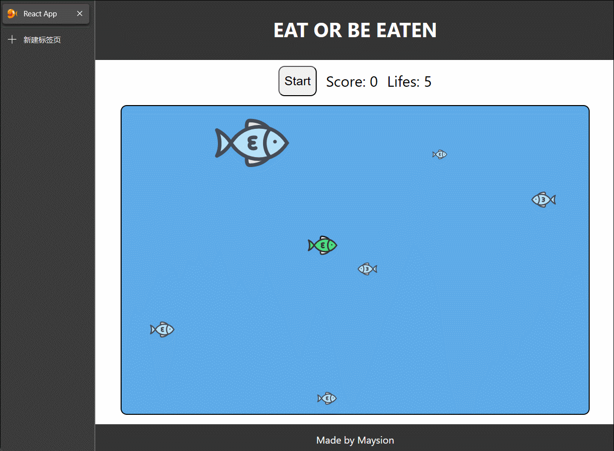

## 实现日志

### 3.14

+ 项目结构初始化
+ 采用响应式布局，加入页眉、页尾和游戏窗口

### 3.15

+ add favicon
+ add fish. it can not move yet

### 3.16

+ fix the bug appeared after adding the function of swimming

### 3.17

+ able to swim

+ able to move the player

### 3.18

+ 实现碰撞检测遇到了问题： 更新鱼群是无效的

### 3.19

+ 增加了多个方向移动的功能（左上、左下etc）
+ 修复了碰撞检测的问题 （发现 useEffect( setA(new_A), [A]) 是可行的）
+ 将定位和大小的单位同一位为 'px'（这是为了规范碰撞检测的实现，但也破坏了响应式布局的实现）

